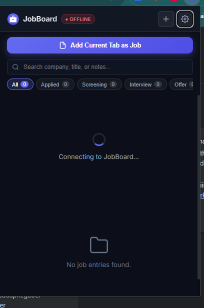
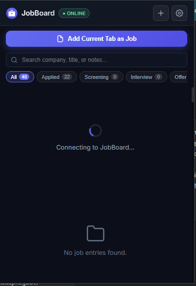
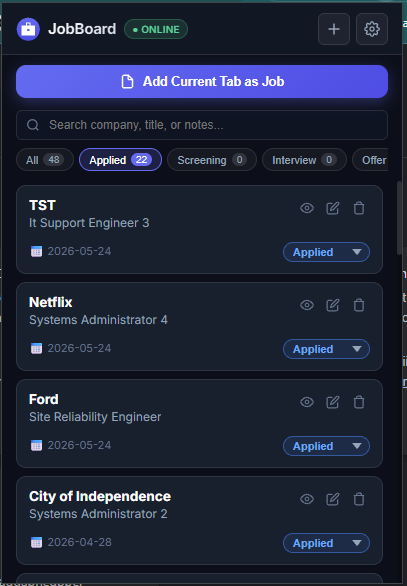
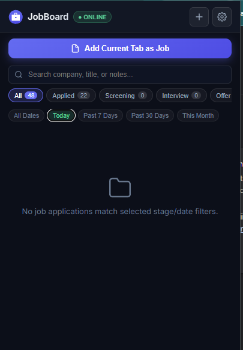
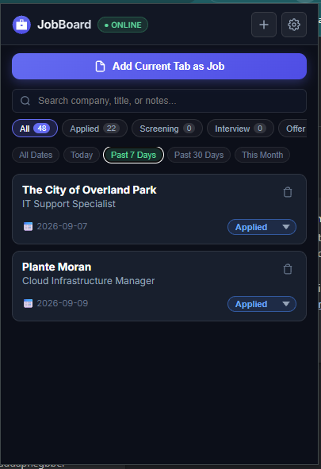
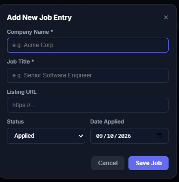
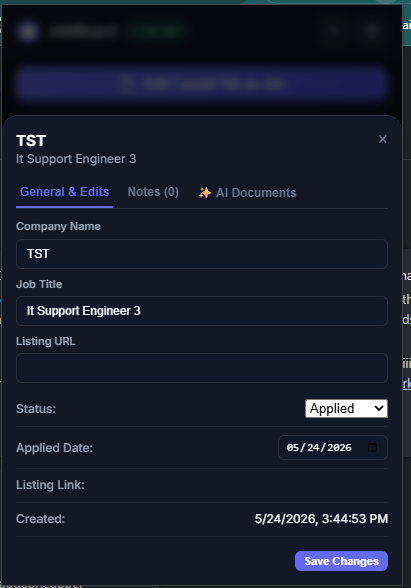
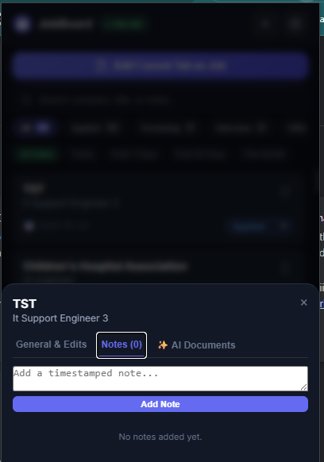
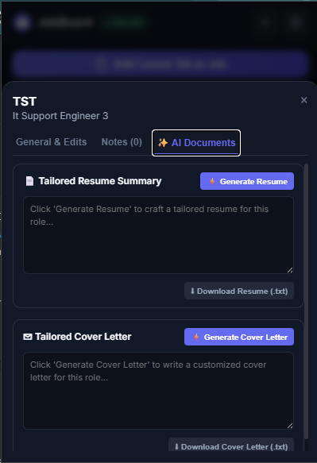

# JobBoard

> A self-hosted, personal job application tracker — built as a kanban board with full data persistence, email attachment, PDF page caching, Master `.docx` base documents, AI-powered customized Resume & Cover Letter generation, and an integrated AI Copilot.


---


## Features

| Feature | Description |
|---|---|
| **Kanban Board** | Drag cards between Applied → Screening → Interview → Offer → Rejected |
| **Date Filtering** | Filter by today, yesterday, last 7/14/30 days, or a custom range |
| **Full-Width Job Modal** | Full-width tabbed layout across General Info, Notes, Emails, Resume, Cover Letter, & Attachments |
| **Master Base Documents** | Upload generic `.docx` Master Resume and Master Cover Letter base templates on main dashboard |
| **AI Resume & Cover Letter Generation** | Tailor Resumes & Cover Letters powered directly by Webhost Gemini API Service |
| **AI Copilot** | Integrated chat assistant powered directly by Webhost Gemini API Service (`192.168.50.217:5050`) |
| **Notes & Update Log** | Timestamped notes per job with delete support |
| **Email Attachment** | Drag `.eml` files from Thunderbird or enter emails manually |
| **PDF Page Cache** | Saves the job listing page as a PDF via headless Chromium |
| **Screenshots** | Paste, drag & drop, or upload screenshots per job |
| **Quick Notepad** | Floating, draggable notepad for interview prep notes — auto-saved to server + localStorage |
| **Rolling Backups** | All data backed up automatically before every write + daily snapshots (14-day retention) |
| **Dark Mode UI** | Premium glassmorphism dark theme |

---

## Quick Start — Docker (Recommended)

### Prerequisites
- [Docker](https://docs.docker.com/get-docker/) and [Docker Compose](https://docs.docker.com/compose/install/)
- *(Optional for AI Features)* Local or remote [Open WebUI](https://docs.openwebui.com/) instance

### Run

```bash
git clone https://github.com/pmitchell-dev/JobBoard.git
cd JobBoard

# Create host directories for persistent data
mkdir -p data/backups data/master_docs cache

docker compose up -d
```

Open **http://localhost:3000** — that's it.

### Data Persistence

All your data lives on the **host machine**, not inside the container:

| Host path | Container path | Contains |
|---|---|---|
| `./data/` | `/app/data/` | `jobs.json`, `notepad.json`, `settings.json`, daily backups |
| `./data/master_docs/` | `/app/data/master_docs/` | Master `.docx` base Resume & Cover Letter + metadata |
| `./cache/` | `/app/cache/` | Saved PDFs, job screenshots, and attachments |

Rebuilding or removing the container never touches your data.

### Upgrade

```bash
git pull
docker compose up -d --build
```

---

## Quick Start — Native Node.js

### Prerequisites
- Node.js 18+
- Google Chrome or Chromium installed (for PDF caching feature)

### Run

```bash
git clone https://github.com/pmitchell-dev/JobBoard.git
cd JobBoard
npm install
npm start
```

Open **http://localhost:3000**.

> **PDF caching** requires Chromium. Set the env var if Puppeteer can't find Chrome automatically:
> ```bash
> PUPPETEER_EXECUTABLE_PATH=/usr/bin/chromium npm start
> ```

---

## AI Functionality & Setup

JobBoard features AI-powered document generation and an integrated AI Copilot powered directly by the dedicated **Webhost Gemini API Service** (`http://192.168.50.217:5050/api/query`).

### Service Integration & Features

1. **Webhost Gemini API Service**:
   - Communication is handled via `POST http://192.168.50.217:5050/api/query`.
   - **Authentication**: Handled automatically on the Webhost server (no API keys required in browser `localStorage`).
   - **Default Model**: `gemini-flash-latest` (fast, reliable, and tailored for resume/cover letter generation).

2. **AI Copilot Chat**:
   - Integrated floating chat assistant on the bottom-right of the screen.
   - Summarizes job notes, drafts emails, answers application questions, and analyzes target positions using direct Gemini queries.

### How AI Document Generation Works

1. **Upload Base Templates**:
   - On the main dashboard under **Master AI Base Documents**, upload your base `.docx` **Master Resume** and **Master Cover Letter**.
2. **Generate Tailored Documents**:
   - Open any job task detail modal.
   - Click **✨ Generate Resume** or **✨ Generate Cover** in the modal footer.
3. **Context Assembly & Execution**:
   - JobBoard compiles position title, company, listing URL, update log notes, and attached emails along with the parsed text from your Master `.docx` file.
   - The Gemini API model generates customized content tailored specifically for the target position.
   - The generated document is saved automatically into the task's **Resume** or **Cover Letter** tab where it can be further edited or downloaded as a `.doc` file.

---

## 📡 Local REST API Integration

JobBoard exposes a full REST API with CORS support (`Access-Control-Allow-Origin: *`) enabled for all local connections (`0.0.0.0:3000`). Local scripts, web apps, browser extensions, or CLI tools can query, create, search, and update job entries.

For full endpoint specifications, request payloads, and code examples (JavaScript, Python, cURL), see [API_DOCUMENTATION.md](file:///c:/Users/pmitchell/.gemini/antigravity/scratch/JobBoard/API_DOCUMENTATION.md).

### Quick Summary of API Endpoints

- `GET /api/health` — API health status & job count metrics
- `GET /api/jobs` — List all jobs (supports `?status=applied` filter)
- `GET /api/jobs/search?q=keyword` — Search jobs across company, title, URL, and notes
- `GET /api/jobs/:id` — Retrieve a single job entry by ID
- `POST /api/jobs` — Add a new job application record
- `PUT /api/jobs/:id` — Full update of job entry fields
- `PATCH /api/jobs/:id` — Partial update (e.g. update status to `interview` or `offer`)
- `DELETE /api/jobs/:id` — Delete job entry and clean up cached assets

Test all API endpoints locally:
```bash
node test_api.js [port]
```

---

## 🧩 Chrome Extension

JobBoard includes a powerful companion Chrome Extension that brings your kanban board directly into your browser popup. It interacts seamlessly with your local JobBoard server.

### Extension Gallery
<details>
<summary><b>Click to view extension screenshots</b></summary>
<p align="center">
  
  
  <br />
  
  
  <br />
  
  
  <br />
  
  
  <br />
  
</p>
</details>

### Features
- **Quick Add**: Automatically detect the company, job title, and URL of the active tab to instantly add a job entry.
- **Double-Click to Edit**: Double-click any job card in the popup to open the detailed drawer.
- **AI Document Generation**: Access the **✨ AI Documents** tab in the drawer to instantly generate customized Resumes and Cover Letters tailored to the job without opening the main dashboard.
- **Dual Date Filtering**: Filter your jobs by "Date Applied" or "Date Created" with quick presets (Today, 7 days, 30 days).
- **Server Sync**: Settings are saved locally, and all edits or status changes sync instantly with your main JobBoard server.

### How to Install
1. Open Chrome and navigate to `chrome://extensions/`.
2. Enable **Developer mode** in the top right.
3. Click **Load unpacked** and select the `extension` folder inside this repository (`JobBoard/extension`).
4. Open the extension, click **⚙ Settings**, and enter your local JobBoard server address (e.g. `http://localhost:3000`).

---

## Configuration

| Environment Variable | Default | Description |
|---|---|---|
| `PORT` | `3000` | HTTP port the server listens on |
| `PUPPETEER_EXECUTABLE_PATH` | *(Puppeteer default)* | Path to Chromium/Chrome for PDF caching |
| `NODE_ENV` | `development` | Set to `production` in Docker |

---

## Project Structure

```
JobBoard/
├── public/
│   ├── index.html       # Single-page app shell
│   ├── app.js           # All client-side logic & AI generation
│   └── style.css        # Dark-mode design system
├── data/
│   ├── jobs.json        # Job records (auto-created)
│   ├── notepad.json     # Quick-notes content (auto-created)
│   ├── settings.json    # Copilot & Open WebUI settings
│   ├── master_docs/     # Master Resume & Cover Letter .docx base files
│   └── backups/         # Daily JSON and .jobboard zip snapshots
├── cache/               # Saved PDFs + screenshots + attachments
├── server.js            # Express API + Puppeteer PDF service + AI proxy
├── Dockerfile
├── docker-compose.yml
└── package.json
```

---

## Backup Strategy

Every write operation (adding/editing/deleting a job, saving notes, uploading master docs):

1. **Rolling backup** — previous `jobs.json` copied to `jobs.backup.json` before overwrite
2. **Daily snapshot** — full `.jobboard` zip archive created daily under `data/backups/` (last 5-14 kept)
3. **Auto-recovery** — if `jobs.json` is corrupted on startup, server restores from `jobs.backup.json` automatically

---

## Tech Stack

- **Runtime:** Node.js 20 + Express
- **PDF Caching:** Puppeteer (headless Chromium)
- **Document Processing:** Mammoth.js (client-side `.docx` raw text extraction & HTML conversion)
- **Frontend:** Vanilla HTML/CSS/JS — no build step, no framework
- **Design:** Dark glassmorphism, Inter font, CSS custom properties
- **Persistence:** JSON files & `.docx` binaries on disk (bind-mounted in Docker)

---

## License

[MIT](LICENSE) — free to use, modify, and self-host.
